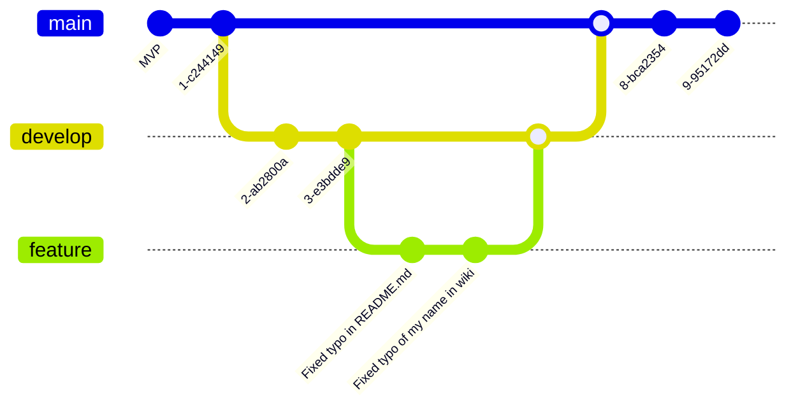

# Mermaid Git Graph Demo

```mermaid
gitGraph
  commit id: "MVP"
  commit
  branch develop
  checkout develop
  commit
  commit
  branch feature
  checkout feature
  commit id: "Fixed typo in README.md"
  commit id: "Fixed typo of my name in wiki"
  checkout develop
  merge feature
  checkout main
  merge develop
  commit
  commit
```
